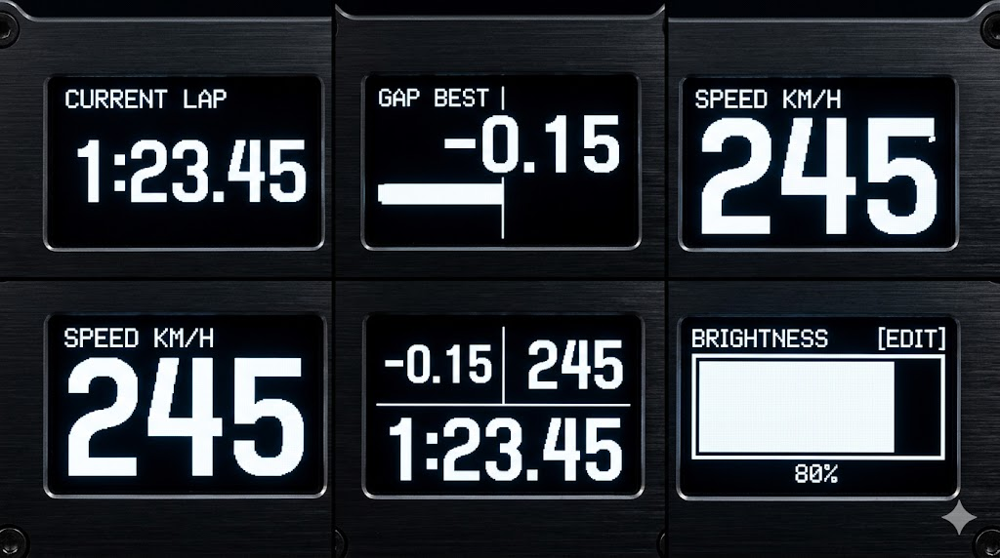

# RacelogicSimHubDevice

Dispositivo ESP32-C3 que recebe telemetria em tempo real do SimHub via Serial e exibe em um display OLED 2.42" (SSD1309, 128×64px).



## Hardware

| Componente | Detalhes |
|------------|----------|
| MCU | ESP32-C3 |
| Display | OLED 2.42" SSD1309 128×64 (I2C) |
| Pinos I2C | SDA=8, SCL=9 @ 400kHz |
| Botão UP | Pino 6 |
| Botão DOWN | Pino 5 |
| Botão ENTER | Pino 7 |

## Telas

Navegue com **UP/DOWN**. **ENTER** alterna sub-modos ou entra em edição:

| Tela | Ação do ENTER |
|------|---------------|
| Tempo de Volta | Alterna Volta Atual → Melhor → Última |
| Delta | Alterna Gap Melhor → Gap Última → Gap Ótimo |
| Velocidade | — |
| Combined | — |
| Configurações | Entra no modo de edição de brilho (UP/DOWN ajustam, ENTER confirma) |

## Configuração no SimHub

No SimHub, crie um dispositivo serial customizado em **115200 baud** enviando:

```
[VOLTA_ATUAL];[MELHOR_VOLTA];[ULTIMA_VOLTA];[GAP_MELHOR];[GAP_ULTIMA];[GAP_OTIMO];[VELOCIDADE]\n
```

Exemplo:
```
1:23.456;1:22.789;1:24.012;-0.667;+0.345;-1.234;187
```

## Flash via Browser

Sem instalar nada: acesse **[accorsirodrigo.github.io/racelogic-esp-device](https://accorsirodrigo.github.io/racelogic-esp-device/)**, escolha a versão e clique em Flash (requer Chrome ou Edge com o ESP32-C3 conectado via USB).

## Build & Flash Manual

Requer [arduino-cli](https://arduino.github.io/arduino-cli/), pacote de placas `esp32:esp32` e a biblioteca `U8g2`.

```bash
# Configuração inicial
arduino-cli config init
arduino-cli config set board_manager.additional_urls https://espressif.github.io/arduino-esp32/package_esp32_index.json
arduino-cli core install esp32:esp32
arduino-cli lib install "U8g2"

# Compilar
arduino-cli compile --fqbn esp32:esp32:esp32c3:CDCOnBoot=cdc RacelogicSimHubDevice.ino

# Gravar (ajuste a porta)
arduino-cli upload -p COM3 --fqbn esp32:esp32:esp32c3:CDCOnBoot=cdc RacelogicSimHubDevice.ino
```

## CI

| Gatilho | Workflow | Resultado |
|---------|----------|-----------|
| Push em `main` (arquivos `.ino`) | `build.yml` | Compila, publica firmware em `docs/firmware/` e cria release versionada |
| Comentar `/build-dev` em um PR | `pr-build.yml` | Compila o branch do PR e posta link do artifact no comentário |
